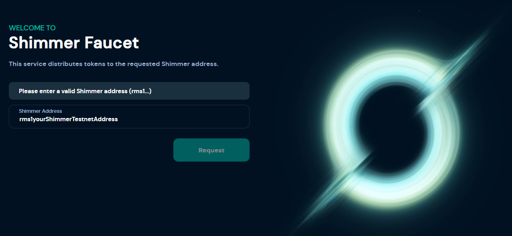

# New Tutorial - How to setup iota.js for development

:::info

In this tutorial you will learn how to create a new project, generate a new address and receive testnet funds from the faucet.

:::


## Prerequisites

- Development Environment and Libraries
  - Installed [Node.js](https://nodejs.org/en/)

***

## Setup

### Prepare development environment

Create a new folder for the tutorial in a location of your choice and navigate to it:

```bash
mkdir iota-js-setup
cd iota-js-setup
```

Run the Node.js initializer to configure the project:

```bash
npm init --yes
```


Install the iota.js library and other helper dependencies:
:::note

Installation might take a while

:::
```bash
npm install @iota/iota.js@next
npm install bip39 dotenv
```


Now create a new file `.env` and add the content below:

```javascript
MNEMONIC = "<You_will_create_your_own_mnemonic_seed_phrase_in_the_next_step_and_paste_it_in_here>"
```

Your new mnemonic seed phrase will be created in the next step and you will paste it in here afterwards.

***


## Create mnemonic script

Create a new file `create-mnemonic.js` and add the following code:

```javascript
// Libraries
const bip39 = require('bip39')
 
// For better readability, some console output will be printed in a different color
const consoleColor = '\x1b[36m%s\x1b[0m';
async function run() {
	// A 256-bits entropy leads to a 24 word mnemonic seed phrase
	const mnemonic = bip39.generateMnemonic(256);
	console.log(consoleColor, 'Copy your mnemonic seed phrase and paste it into the .env file:');
	console.log(mnemonic, '\n');
}
run();
```

Run the script `create-mnemonic.js` and check the console output for your new mnemonic seed phrase:
```console
node create-mnemonic.js
```
Now you can copy the seed phrase and paste it into the previously created `.env` file.

***

Your `package.json` file should look something like this:

```yaml
{
  "name": "iota-js-setup",
  "version": "1.0.0",
  "description": "",
  "main": "index.js",
  "dependencies": {
    "@iota/iota.js": "^1.9.0-stardust.25",
    "bip39": "^3.0.4",
    "dotenv": "^16.0.1"
  },
  "scripts": {
    "test": "echo \"Error: no test specified\" && exit 1"
  },
  "author": "",
  "license": "Apache-2.0"
}
```
***


## Create an address

Create a new file `create-address.js` and add the following code:


```javascript
const { Converter } = require("@iota/util.js");
const { Bip32Path, Bip39 } = require("@iota/crypto.js");
const {
  Bech32Helper,
  Ed25519Address,
  Ed25519Seed,
  ED25519_ADDRESS_TYPE,
  generateBip44Address,
  IOTA_BIP44_BASE_PATH,
  SingleNodeClient,
} = require("@iota/iota.js");

require("dotenv").config({ path: "./.env" });

const API_ENDPOINT = "https://api.testnet.shimmer.network";

async function run() {
  const client = new SingleNodeClient(API_ENDPOINT);

  const info = await client.info();

  console.log("Base");

  // Generate the seed from the Mnemonic
  const baseSeed = Ed25519Seed.fromMnemonic(process.env.MNEMONIC);
  console.log("\tSeed", Converter.bytesToHex(baseSeed.toBytes()));

  // Generate the next addresses for your account.
  console.log();
  console.log("Generated Addresses...");
  const addressGeneratorAccountState = {
    accountIndex: 0,
    addressIndex: 0,
    isInternal: false,
  };
  const path = generateBip44Address(addressGeneratorAccountState);
  const addressSeed = baseSeed.generateSeedFromPath(new Bip32Path(path));
  const addressKeyPair = addressSeed.keyPair();
  const indexEd25519Address = new Ed25519Address(addressKeyPair.publicKey);
  const indexPublicKeyAddress = indexEd25519Address.toAddress();

  console.log(
    "\tAddress (Bech32)",
    Bech32Helper.toBech32(
      ED25519_ADDRESS_TYPE,
      indexPublicKeyAddress,
      info.protocol.bech32Hrp
    )
  );
}

run()
  .then(() => console.log("Done"))
  .catch((err) => console.error(err));

```

If you run it, it will get your mnemonic from the `.env`file, create a seed from it and generate a new address. Just run the following command and you will see your testnet shimmer address in your console!

```bash
node create-address.js
```

## Request tokens via faucet website

Now you can go to the [Shimmer Testnet Faucet Website](https://faucet.testnet.shimmer.network/), paste in your newly created address and request funds.

:::note

The 'Request' button will become clickable as soon as a valid Shimmer address is recognized.

:::


***

Congratulations, you are now ready to explore other exciting features of the Shimmer network, such as native tokens and NFT's.
